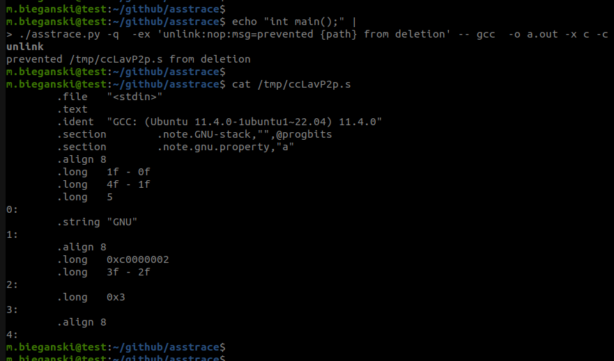
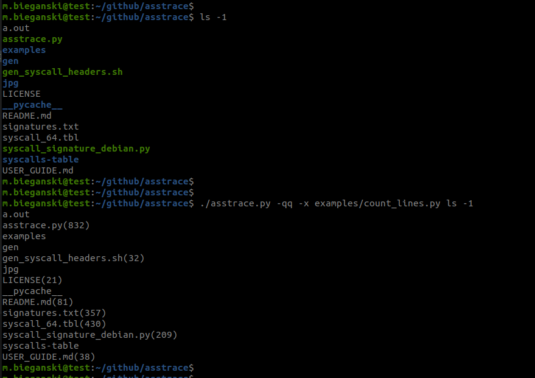

# About
`asstrace` stands for **a** **s**tateful **strace**-like - Linux syscall tampering-first `strace`-like tool.

As opposed to `strace`, `asstrace` alters binary behavior by being "man in the middle" of binary and operating system. If your goal is to understand why some black-box binary is not working as expected, then `strace` with all it's advanced features is the way to go.

`asstrace` is designed to **provide a convenient way of altering binary behavior and sharing it to other people**.

It doesn't change the binary itself, but allows for manipulating behavior of system calls that the binary executes.
`asstrace` is designed to work with `Linux`. Currently `x86` and `RISC-V` are supported.

# Example use cases

* legacy executable which source code is not available no longer works on modern workstations, as it assumes presence of some special files (sockets, device character special etc.). We can intercept all system calls touching that particular device and provide our own implementation that emulate the device (all the emulation is in user mode).

* legacy black-box executable does not work because inside a binary there are IP address and port hardcoded, that are no longer accessible as the service moved to a different server. We can intercept network system calls that try to access non-existing address, and change it so that the new address is used.[[sample run]](#network_forwarding-example) [[source code]](./examples/network_forwarding.cc)

* black-box executable does some computation, and as a result it creates a single output file. During computation it creates lots of meaningful temporary files, but unfortunately it deletes them all before output is produced. Using `asstrace` we can intercept all `unlink` system calls and cause them to do nothing. This way no temporary files get removed! [[sample run]](#unlink-example) [[source code]](./examples/unlink.cc)

# `unlink` example

In this example we run `gcc`, but prevent it from deleting temporary files.

The command used: `echo "int main();" | ./asstrace.py -q  -ex 'unlink:nop:msg=prevented {path} from deletion' -- gcc  -o a.out -x c -c -`




# `count_lines` example

In this example we manipulate `ls -1` command, so that for each regular file that it prints it will include metadata: number of lines.

The command used: `./asstrace.py -qq -x examples/count_lines.py ls -1`



The code of `write` syscall in `count_lines` example is slightly more complicated, thus not suitable for `--ex` as previously. Instead we have a Python file that can use `API` functionality:

```py
from pathlib import Path
from asstrace import API

def asstrace_write(fd, buf, num, *_):
    if fd != 1:
        # capture stdout only
        return
    path = Path(API.ptrace_read_mem(buf, num)[:-1].decode("ascii")) # strip '\n' and decode from bytes
    if not path.is_file():
        API.invoke_syscall_anyway()
    else:
        try:
            num_lines = len(path.read_text().splitlines())
        except UnicodeDecodeError:
            # raw-bytes file
            API.invoke_syscall_anyway()
            return
        res_str = f"{path}({num_lines})\n"
        print(res_str, end="")
        return len(res_str) # 'ls -1' program will think that it has written that many characters. 
```

# Few small examples

```
-ex 'open,openat:delay:time=0.5'        - invoke each 'open' and 'openat' syscall as usual, but sleep for 0.5s before each invocation
-ex 'unlink:nop'                        - 'unlink' syscall will not have any effect. value '0' will be returned to userspace.
-ex 'mmap:nop:ret=-1'                   - 'mmap' syscall will not have any effect. value '-1' will be returned to userspace (fault injection; see 'man mmap').
-ex 'open:nop:ret=-1' -ex read:detach   - fail each open, detach on first read
```

# Verbose mode

When invoking without `-q` or `-qq` params `asstrace.py` will print all syscalls executed to stderr, in similar manner as `strace` do (but without fancy beautifying):

```bash
m.bieganski@test:~/github/asstrace$ ./asstrace.py ls
openat(0xffffff9c, 0x7f4883e8d660, 0x80000, 0x0, 0x80000, 0x7f4883e8d660) = 0x3
read(0x3, 0x7ffd70b6e9b8, 0x340, 0x0, 0x80000, 0x7f4883e8d660) = 0x340
pread64(0x3, 0x7ffd70b6e5c0, 0x310, 0x40, 0x7ffd70b6e5c0, 0x7f4883e8d660) = 0x310
pread64(0x3, 0x7ffd70b6e580, 0x30, 0x350, 0x7ffd70b6e5c0, 0x0) = 0x30
pread64(0x3, 0x7ffd70b6e530, 0x44, 0x380, 0x7ffd70b6e5c0, 0x0) = 0x44
newfstatat(0x3, 0x7f4883ebdee9, 0x7ffd70b6e850, 0x1000, 0x7f4883e8d660, 0x7f4883eca2e0) = 0x0
pread64(0x3, 0x7ffd70b6e490, 0x310, 0x40, 0xc0ff, 0x7f4883e8db08) = 0x310
mmap(0x0, 0x228e50, 0x1, 0x802, 0x3, 0x0) = 0x7f4883c00000
mprotect(0x7f4883c28000, 0x1ee000, 0x0, 0x802, 0x3, 0x0) = 0x0
...
```


# User Guide

See [user guide](./USER_GUIDE.md) for more details.